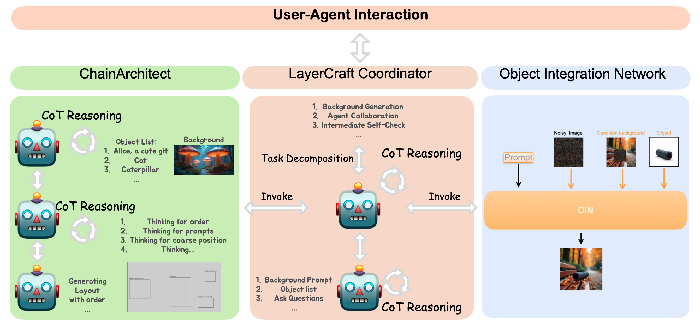
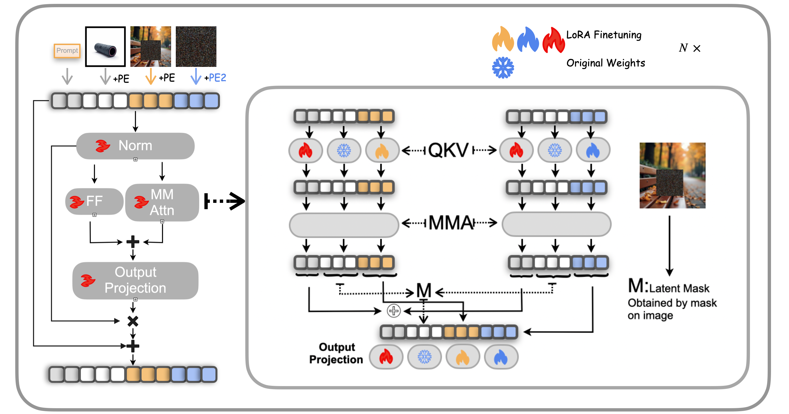
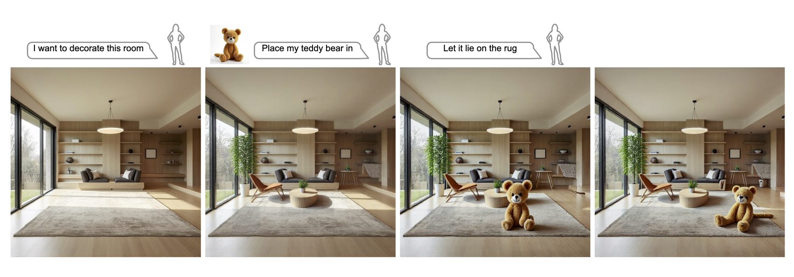
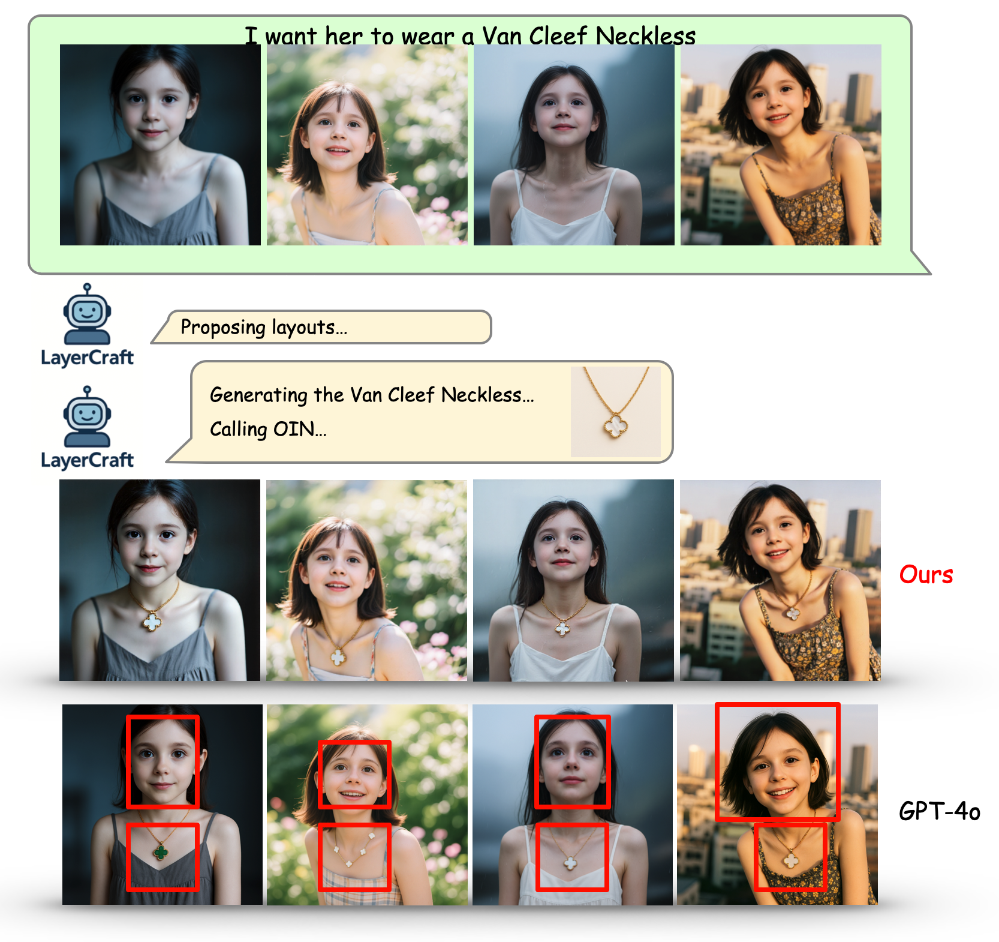
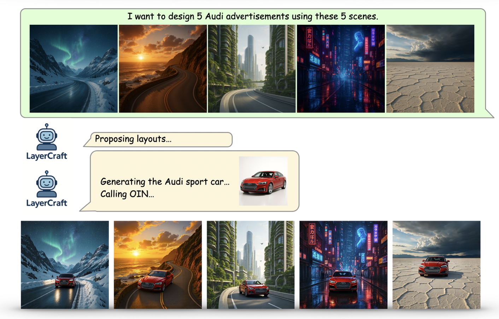

# LayerCraft
This is the official repository for **"LayerCraft: Enhancing Text-to-Image Generation with CoT Reasoning and Layered Object Integration"**
[](https://arxiv.org/abs/2504.00010)
[](https://arxiv.org/pdf/2504.00010)
<p align="center">
  
</p>

<p align="center">
  <b>Figure:</b> Application demonstrations for LayerCraft. <b>Left:</b> Demonstrates batch collage editing capabilities. A user uploads graduation photos and LayerCraft seamlessly integrates a graduation bear across all images. The system first generates a reference bear for consistency, then analyzes optimal placement while preserving facial identity and background integrity. <b>Right:</b> Illustrates the structured text-to-image generation process. From a simple "Alice in Wonderland" prompt, LayerCraft employs chain-of-thought reasoning to sequentially generate background elements, determine object layout, and compose the final image. The framework supports post-generation customization, as shown with the lion integration.
</p>

## News
- [2025-09-18] Paper is accepted by NeurIPS 2025!

## Model Pipeline

<p align="center">
  
</p>
<p align="center">
  <b>Figure:</b> LayerCraft framework overview. A coordinator agent orchestrates the process, employing ChainArchitect to derive a dependency-aware 3D layout and the Object Integration Network (OIN) to seamlessly integrate objects into specified regions of a background image.
</p>

<p align="center">
  
</p>
<p align="center">
  <b>Figure:</b> Architecture of the Object Integration Network (OIN). Given a text prompt, a background with a designated region, and a reference object, OIN blends the subject into the scene via LoRA-weighted pathways across feed-forward and multi-modal attention within the FLUX model.
</p>


## Highlighted Features
<details open>
<summary>Customized T2I Generation</summary>
LayerCraft supports customized T2I generation with minimal effort.

For example, check out our Indoor Decoration examples below that showcase how users can easily add decorative elements like furniture, plants, and artwork to existing interior images.

<p align="center">
  
</p>

We show the comparison between LayerCraft and other T2I methods in the following figure.

<p align="center">
  
</p>

</details>


<details open>
<summary>Batch Collage Editing</summary>
LayerCraft supports batch collage editing with minimal effort. 

For example, check out our Batch Collage Editing examples below that showcase how users can easily edit multiple images at once.
<p align="center">
  
</p>

<p align="center">
  
</p>

</details>


<details open>
<summary>Subject Driven Inpainting</summary>

Object Integration Network (OIN) in LayerCraft leads the way in subject-driven inpainting.

<p align="center">
  
</p>

</details>


## Abstract
<details>
<summary>Click to expand</summary>
Text-to-image generation (T2I) has become a key area of research with broad applications. However, existing methods often struggle with complex spatial relationships and fine-grained control over multiple concepts. Many existing approaches require significant architectural modifications, extensive training, or expert-level prompt engineer-ing. To address these challenges, we introduce **LayerCraft**, an automated framework that leverages large language models (LLMs) as autonomous agents for structured procedural generation. LayerCraft enables users to customize objects within an image and supports narrative-driven creation with minimal effort. At its core, the system includes a coordinator agent that directs the process, along with two specialized agents: **ChainArchitect**, which employs chain-of-thought (CoT) reasoning to generate a dependency-aware 3D layout for precise instance-level control, and the Object-**Integration Network (OIN)**, which utilizes LoRA fine-tuning on pre-trained T2I models to seamlessly blend objects into specified regions of an image based on textual prompts—without requiring architectural changes. Extensive evaluations demonstrate LayerCraft's versatility in applications ranging from multi-concept customization to storytelling. By providing non-experts with intuitive, precise control over T2I generation, our framework democratizes creative image creation.
</details>

## Environment Installation

Follow these steps to set up a clean environment:

```bash
# 1) Create a Conda environment (Python 3.12)
conda create -n layercraft python=3.12 -y
conda activate layercraft

# 2) Install dependencies
pip install -r requirements.txt
```

## Train OIN Model
```bash
cd train
# insert your wandb api key into the train.sh file and the lora paths for the OIN model
sh train.sh
```

## TODO:
1. Release the code for Object Integration Network (OIN) for T2I models and show more examples. [Done]
2. Release the weights for the OIN model. 
